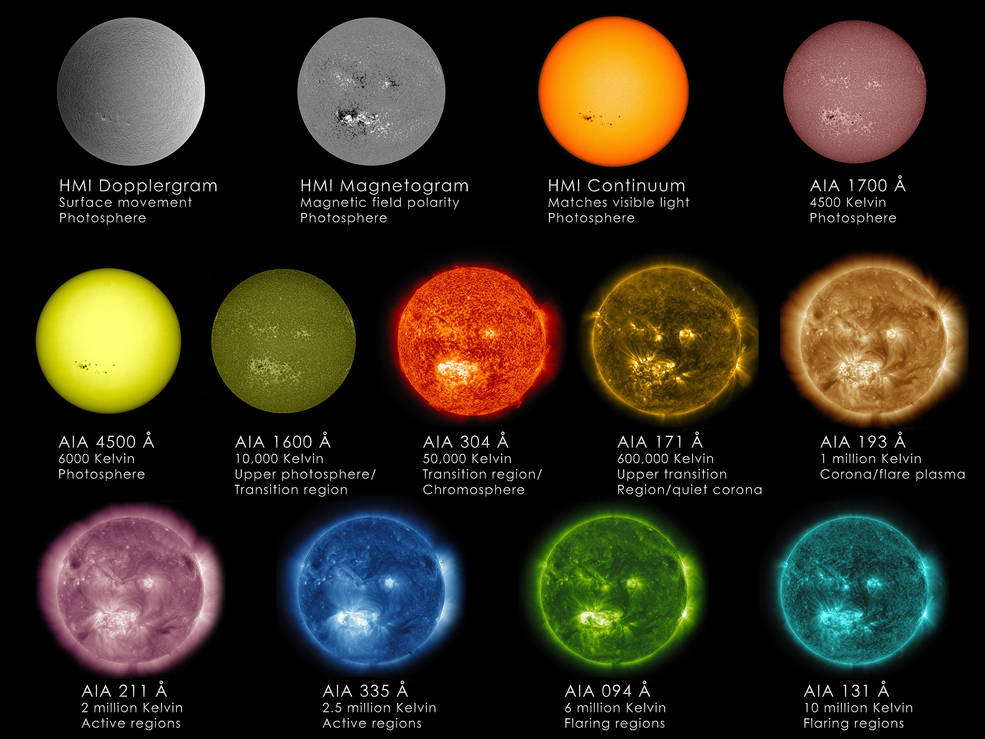

.. _sec:obsuniv:

The observable Universe
=====================================

.. highlight:: none

Looking at the night sky with our own eyes is not the only way to study the
Universe. "Messages" that we received from celestial bodies come in various
forms: radio, infrared, visible, ultraviolet, X-ray, :math:`\gamma`-ray,
and gravitational waves. Other than gravitational waves, the rest of the
aforementioned "messengers" are different forms of the electromagnetic
radiation. It is a form of electromagnetic energy that is observable at
different wavelengths, with the radio signals have the shortest wavelength
and :math:`\gamma`-rays have the longest wavelength. Here is a nice
`Introduction to the Electromagnetic Spectrum
<https://science.nasa.gov/ems/01_intro>`_.

Stars and galaxies are usually observable in many wavelength ranges.
Furthermore, the same target (e.g., the Sun and the Milky Way) can appear
differently at different wavelengths.

  NASA's Solar Dynamics Observatory (SDO) views the Sun in 13 different ways,
  using two different on-board instruments. `Credits: NASA/SDO/Goddard Space
  Flight Center
  <https://www.nasa.gov/mission_pages/sunearth/news/light-wavelengths.html>`_.

.. figure:: mw_view.jpg
  :width: 900
  :scale: 60 %
  :alt: map to buried treasure
  :figclass: align-center

  The combined view of the Milky Way from radio all the way up to
  :math:`\gamma`-rays. `Credits: NASA/Goddard Space Flight Center
  <https://asd.gsfc.nasa.gov/archive/mwmw/mmw_images.html>`_

Accordingly, astronomers often need to probe the same target with different
telescopes that cover a wide range of the electromagnetic spectrum. For the
PH450 project, we only focus on the X-ray Universe observed with ESA's
`XMM-Newton space observatory <https://www.cosmos.esa.int/web/xmm-newton>`_.

  The space observatories lead by European Space Agency and their
  wavelength coverage across the entire electromagnetic spectrum.
  `Copyright: ESA
  <https://sci.esa.int/web/education/-/59465-esa-fleet-across-the-spectrum-poster>`_.

.. topic:: Assignment

  - There are a few X-ray space observatories launched since 1999, including
    `NASA's Chandra space observatory
    <https://www.nasa.gov/mission_pages/chandra/main/index.html>`_.
    Write a few sentences about Chandra and 2 to 4 other similar X-ray space
    observatories.

  - Take a loot at 5 to 7 images of celestial bodies from the `XMM image gallery
    <https://www.cosmos.esa.int/web/xmm-newton/image-gallery>`_ and the
    `Chandra photo album <https://chandra.harvard.edu/photo/>`_.
    Write no more than a few sentences about each celestial body.

Reference
-------------
- `Analyzing the Universe at multiple wavelengths (video)
  <https://www.youtube.com/watch?v=Vc39qjGuqg4>`_

- `ESA's fleet across the spectrum poster (webpage)
  <https://sci.esa.int/web/education/-/59465-esa-fleet-across-the-spectrum-poster>`_

- `Multiwavelength Milky Way Images (webpage)
  <https://asd.gsfc.nasa.gov/archive/mwmw/mmw_images.html>`_

- `Sun Primer: Why NASA Scientists Observe the Sun in Different Wavelengths (webpage)
  <https://www.nasa.gov/mission_pages/sunearth/news/light-wavelengths.html>`_

- `Wavelengths from the Sky (video)
  <https://www.youtube.com/watch?v=2ozy9tUHJ68>`_
